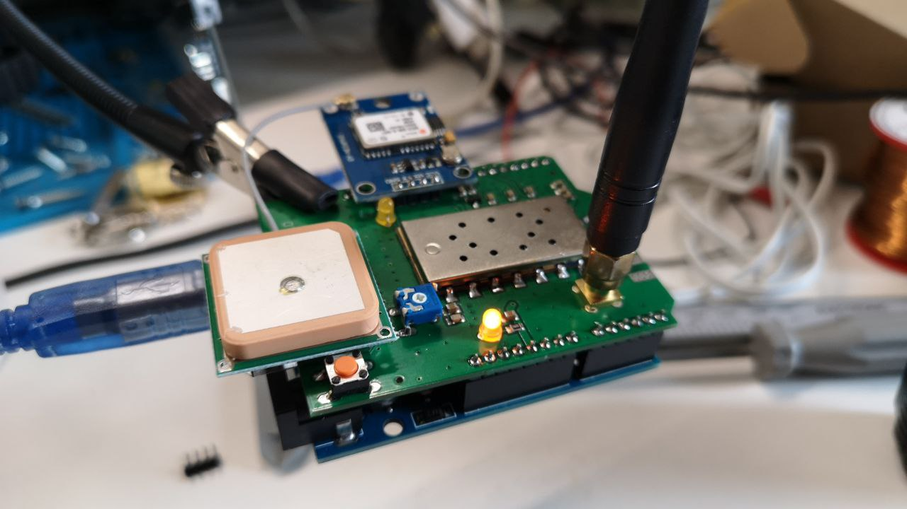

# Firmware for the Dorji SA818 APRS shield

My modifications to the GPS sketch:

* Use TinyGPSPlus library
* Add somewhat smart beaconing

Original source file:

[handiko/Arduino-APRS/Arduino-Sketches/Test/APRS_GPS_GPRMC/APRS_GPS_GPRMC.ino ](https://github.com/handiko/Arduino-APRS/blob/master/Arduino-Sketches/Test/APRS_GPS_GPRMC/APRS_GPS_GPRMC.ino)